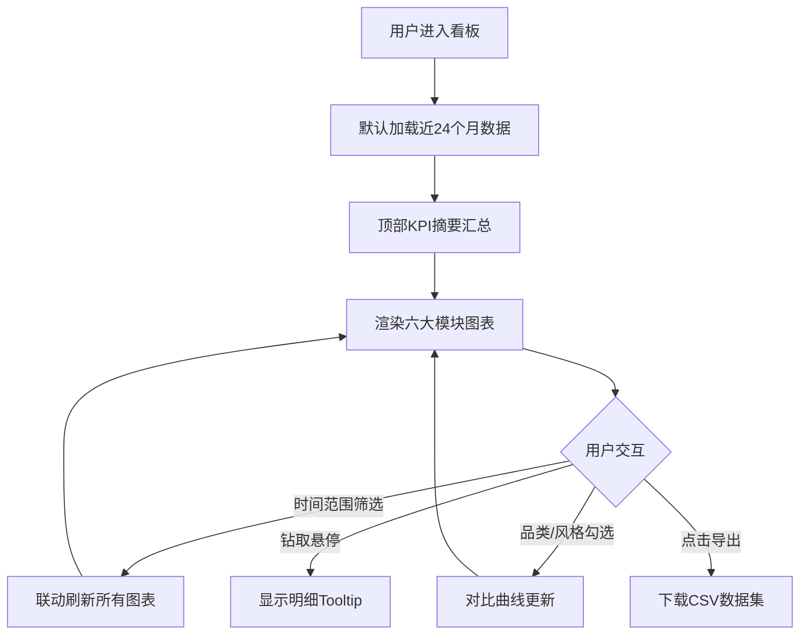

# 家具行业市场数据分析看板 — 产品需求文档 (PRD)

## 1. 产品概述

面向家具行业决策者的专业级市场数据分析看板，通过六大可视化模块提供从品类销售、市场结构、风格热度、消费决策、尺寸偏好到地产关联的全景洞察，辅助企业制定产品、渠道与库存策略。
- 目标用户：家具品牌决策者、产品经理、市场分析师、渠道运营负责人
- 解决问题：市场数据分散、风格趋势难追踪、地产周期与销售关联不透明
- 市场价值：将多源数据沉淀为可交互、可导出的决策驾驶舱，提升经营决策效率与准确度

## 2. 核心功能

### 2.2 功能模块

单页面看板（Dashboard），包含以下六大核心模块 + 顶部控制栏 + 全局摘要指标：

1. **品类销售趋势分析**：六大品类（沙发、床、餐桌椅、书桌、柜类、床垫）月度销售额占比环形图 + 同比增速折线图，支持时间范围筛选与品类对比
2. **市场结构分析**：全屋定制 vs 成品家具市场份额变化趋势，含历史数据与预测曲线
3. **风格热度追踪**：七大风格（现代简约、新中式、轻奢、北欧、日式、美式、工业风）搜索热度指数趋势，突出现代简约领先地位与新中式增长态势
4. **消费决策因素权重分析**：雷达图呈现材质（实木/板式/布艺/皮质）、价格段、品牌、环保等级（ENF/E0/E1级板材）对购买决策的影响权重
5. **尺寸偏好分析**：按户型分类展示主流家具尺寸趋势，重点标注小户型畅销的伸缩餐桌与多功能沙发床
6. **地产关联分析**：新房交付量与家具销售量滞后相关性模型（默认6-12个月滞后期），预测未来12个月市场走势

### 2.3 页面详情

| 模块 | 子模块 | 功能描述 |
|------|--------|----------|
| 顶部控制栏 | 时间范围筛选 | 年度/季度/月度切换；起止时间选择器 |
| 顶部控制栏 | 摘要指标卡 | 总销售额、同比增速、定制占比、热门风格四个KPI |
| 顶部控制栏 | 导出按钮 | 导出当前看板数据为CSV |
| 品类销售趋势 | 占比环形图 | 六大品类当期销售额占比，悬停显示数值与同比 |
| 品类销售趋势 | 同比增速折线 | 各品类月度同比增速折线，可勾选品类对比 |
| 市场结构 | 份额趋势图 | 全屋定制/成品份额历史走势 + 预测虚线 |
| 风格热度 | 热度指数折线 | 七风格热度趋势，现代简约高亮、新中式标注增长 |
| 消费决策 | 权重雷达图 | 四维度权重对比，支持按材质细分切换 |
| 尺寸偏好 | 尺寸分布图 | 按户型分组的主流尺寸分布，标注畅销单品 |
| 地产关联 | 相关性模型 | 新房交付与家具销售双轴曲线 + 滞后相关系数 + 预测 |

## 3. 核心流程

用户进入看板 → 默认加载近24个月数据 → 顶部摘要指标自动汇总 → 浏览六大模块图表 → 调整时间范围/品类筛选 → 各图表联动更新 → 钻取查看明细 → 导出当前数据集。

## 4. 用户界面设计

### 4.1 设计风格

- **设计概念**："匠造数据"（Artisan Analytics）—— 高端家具杂志质感与数据智能的融合，温暖木质色调、精致排版、克制而有力的视觉层次
- **主色系**：暖奶油底（#F7F3ED）+ 深咖啡文字（#2B2118）+ 赤陶主点缀（#B85C38）+ 鼠尾草绿辅助（#6B7F5C）
- **数据配色**：六大品类独立色板（赤陶/鼠尾草/琥珀/靛蓝/灰玫/暖灰），保证图表辨识度
- **字体**：标题用衬线字体 Fraunces（杂志感），正文用 DM Sans（清晰现代），数字用等宽 JetBrains Mono
- **按钮风格**：圆角矩形（8px），主操作赤陶实色，次操作描边，悬停阴影过渡
- **布局**：三列响应式网格（桌面12栅格 → 平板双列 → 手机单列），卡片式模块，圆角14px，柔和投影
- **图标**：lucide-react 线性图标，统一1.6px描边

### 4.2 页面设计概览

| 区域 | UI 元素 |
|------|---------|
| 顶部栏 | 品牌 Logo + 时间筛选器 + KPI 指标卡 + 导出按钮，暖白背景，底部细分割线 |
| 左列 | 品类销售趋势（环形图+折线）、消费决策权重雷达图 |
| 中列 | 市场结构趋势、风格热度追踪 |
| 右列 | 尺寸偏好分析、地产关联分析 |
| 卡片 | 标题+副标题+控件区+图表区+脚注，14px圆角，悬停微抬升 |

### 4.3 响应式

- 桌面端（≥1280px）：三列布局，模块并排展示
- 平板端（768-1279px）：双列布局，第三列下移
- 移动端（<768px）：单列布局，图表自适应高度，筛选器折叠为下拉
- 触控优化：图表交互区域增大，悬停态转为点击态

### 4.4 性能优化

- 前端数据缓存：Zustand store 缓存 API 结果，按时间范围键缓存
- 图表懒渲染：可视区内图表优先渲染
- 后端聚合：Python 端完成数据清洗与聚合，前端只接收渲染数据
- CSV 预生成：模拟数据脚本一次性生成，避免运行时计算
