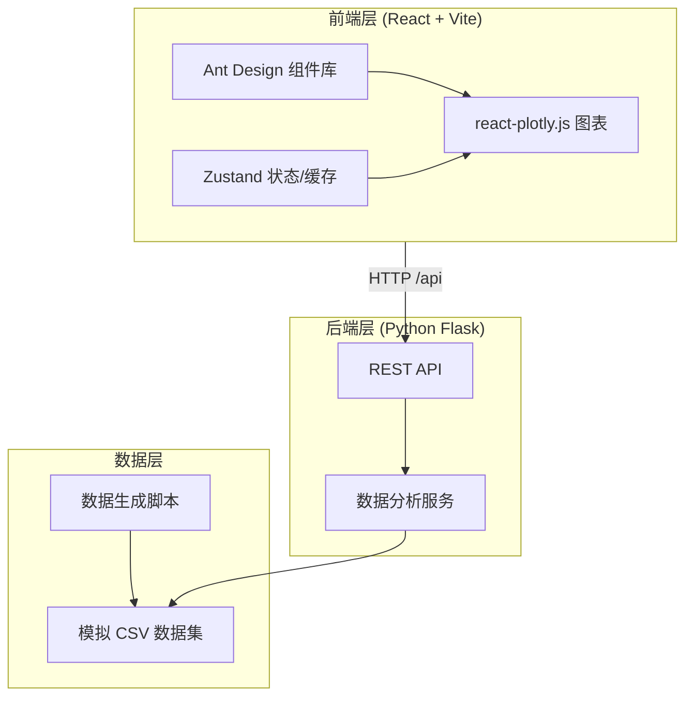
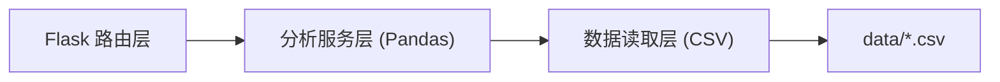

# 家具行业市场数据分析看板 — 技术架构文档

## 1. 架构设计



## 2. 技术说明

- **前端**：React@18 + TypeScript + Vite（使用 react-ts 模板）
- **UI 组件库**：Ant Design@5（满足表单控件、筛选器、布局栅格需求）
- **数据可视化**：Plotly.js + react-plotly.js（实现交互式动态图表）
- **样式**：Tailwind CSS（响应式与原子化样式）
- **状态管理**：Zustand（含数据缓存机制）
- **图标**：lucide-react
- **后端**：Python 3 + Flask + Pandas（数据清洗、转换与分析）
- **数据来源**：模拟 CSV 数据集（由 Python 脚本生成）
- **初始化工具**：vite-init（react-ts 模板）

## 3. 路由定义

| 路由 | 用途 |
|------|------|
| / | 看板主页面，承载六大可视化模块 |

## 4. API 定义

### 4.1 GET /api/summary
返回顶部摘要指标。

响应：
```typescript
interface SummaryResponse {
  totalSales: number;        // 总销售额（万元）
  yoyGrowth: number;         // 同比增速 %
  customShare: number;       // 定制占比 %
  topStyle: string;          // 热门风格
}
```

### 4.2 GET /api/category-trends?start=YYYY-MM&end=YYYY-MM
返回六大品类月度销售额、占比与同比增速。

```typescript
interface CategoryTrendItem {
  month: string;
  categories: {
    name: 'sofa'|'bed'|'dining'|'desk'|'cabinet'|'mattress';
    sales: number;     // 万元
    share: number;     // %
    yoy: number;       // %
  }[];
}
interface CategoryTrendsResponse { months: CategoryTrendItem[]; }
```

### 4.3 GET /api/market-structure
返回全屋定制 vs 成品家具历史份额与预测。

```typescript
interface MarketStructureResponse {
  history: { month: string; custom: number; ready: number }[];
  forecast: { month: string; custom: number; ready: number }[];
}
```

### 4.4 GET /api/style-heat
返回七大风格搜索热度指数趋势。

```typescript
interface StyleHeatResponse {
  months: string[];
  styles: { name: string; values: number[]; yoy: number }[];
}
```

### 4.5 GET /api/decision-factors
返回消费决策因素权重（材质/价格/品牌/环保等级）。

```typescript
interface DecisionFactorsResponse {
  axes: string[];   // ['材质','价格段','品牌','环保等级']
  series: { name: string; values: number[] }[]; // 各细分维度权重
}
```

### 4.6 GET /api/size-preference
返回按户型分类的主流家具尺寸分布与畅销单品。

```typescript
interface SizePreferenceResponse {
  houseTypes: { name: string; items: { furniture: string; size: string; popularity: number; highlight?: boolean }[] }[];
}
```

### 4.7 GET /api/realestate-correlation?lag=9
返回新房交付量与家具销售滞后相关性及未来12个月预测。

```typescript
interface RealEstateResponse {
  history: { month: string; delivery: number; sales: number }[];
  correlation: number;   // 滞后相关系数
  optimalLag: number;     // 最优滞后期（月）
  forecast: { month: string; predictedSales: number }[];
}
```

### 4.8 GET /api/export?module=category-trends&start=&end=
返回对应模块 CSV 文本流，供前端下载。

## 5. 服务端架构



- **路由层**：Flask Blueprint，参数校验与响应序列化
- **分析服务层**：Pandas 读取 CSV → 清洗/聚合/计算（同比、占比、相关系数、预测）→ 返回 JSON
- **数据读取层**：按模块加载对应 CSV，支持时间范围过滤

## 6. 数据模型

### 6.1 CSV 数据集定义

| 文件 | 字段 | 说明 |
|------|------|------|
| category_sales.csv | month, sofa, bed, dining, desk, cabinet, mattress, sofa_prev, bed_prev... | 月度各品类销售额（万元）及同期去年值 |
| market_structure.csv | month, custom_share, ready_share | 定制/成品份额 % |
| style_heat.csv | month, modern, neo_chinese, luxury, nordic, japanese, american, industrial | 七风格热度指数 |
| decision_factors.csv | dimension, material, price, brand, eco | 决策权重细分 |
| size_preference.csv | house_type, furniture, size, popularity, is_hot | 户型×家具尺寸流行度 |
| realestate_sales.csv | month, new_house_delivery, furniture_sales | 月度新房交付量与家具销售额 |

### 6.2 数据生成脚本逻辑

- 时间范围：2022-01 至 2025-06（含历史与可预测区间）
- 品类销售：基线 + 季节性（Q4 旺季）+ 趋势 + 随机扰动
- 市场结构：定制份额逐年上升（38%→52%）
- 风格热度：现代简约高位领先，新中式年增速最高
- 地产关联：家具销售滞后新房交付约9个月
